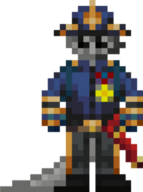

# Капитан

<figure><figcaption>
Глава объекта. Занимается руководством всей станции, главные его помощники это главы отделов.
</figcaption></figure>

<figure><figcaption>
Обычный приказ капитана для ГВ
</figcaption></figure>

 

<figure><figcaption>
Капитан на приеме
</figcaption></figure>

Вы - капитан станции, верхушка в цепочке командования. Ваша обязанность - обеспечить стабильность и работоспособность станции, а также выполнять указания Центрального Командования.

Вы должны иметь опыт работы на всех руководящих должностях. В начале раунда возьмите с собой Диск Ядерной Аутентификации, свяжитесь с Главами и проведите небольшой брифинг, продолжайте время от времени проверять, что все работает как часы.\
\
Как капитан, ваша самая важная сила — это не ваша ID карта с полным доступом или причудливая антикварная побрякушка, а тот факт, что у вас обычно есть около шести глав отделов, которыми вы руководите, чтобы решать проблемы, с которыми вы не хотели бы иметь дело.\

### Полномочия капитана

У вас есть широкий (но не бесконечный) диапазон полномочий капитана. Вы обладаете следующими особыми привилегиями:

* Казни любых заключенных должны быть одобрены через вас (ожидается, что вы, по крайней мере, сделаете беглую проверку того, оправдана ли казнь или нет)
* Вы можете понизить в должности глав отделов, которых вы считаете крайне непригодными для работы или непокорными в интересах станции в целом (хотя большинство из глав отделов может признать вас непригодным для командования и понизить вас в должности)
* У вас есть ID карта с доступом ко всем дверям на станции и запасное с таким же. Используйте его с умом и не теряйте.
* Как правило, вы принимаете решение эвакуировать станцию ​​и считаете это потерей, однако любой из глав отделов также может воспользоваться этой привилегией в случае чрезвычайной ситуации. Имейте в виду, что преждевременная эвакуация станции или по незначительной причине навлечет на вас неприятности.
* Вы несете ответственность за диск ядерной аутентификации. Этот диск должен присутствовать в ядерной боеголовке, чтобы активировать ее, вместе со случайным пятизначным кодом активации. Ядерные оперативники будут искать вас чтобы заполучить драгоценный диск, так что берегите его.

Вы - капитан станции, верхушка в цепочке командования. Ваша обязанность - обеспечить стабильность и работоспособность станции, а также выполнять указания Центрального Командования.\
